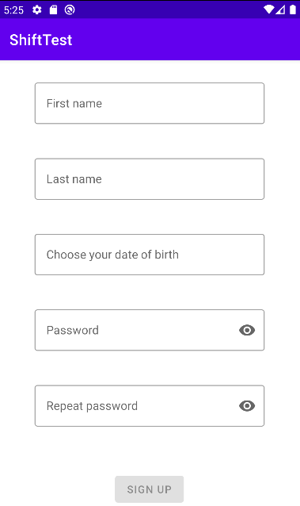
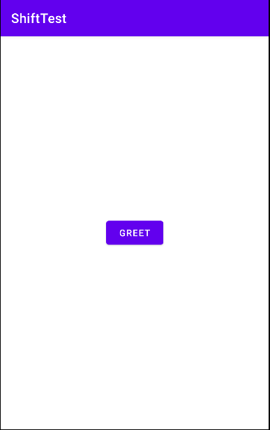
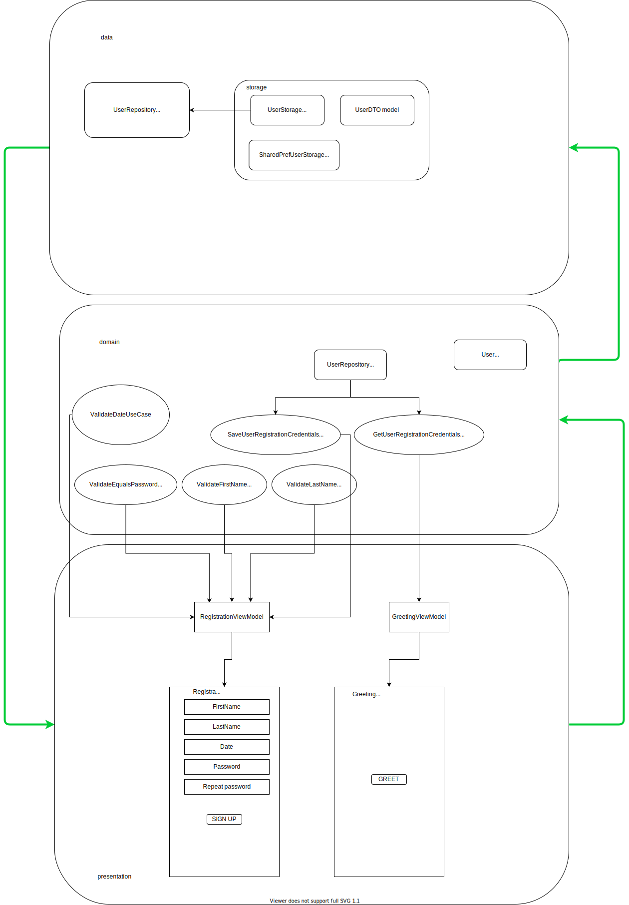

# SHIFT
Проект, созданный с целью выполнения тестового задания в лабораторию ШИФТ.
### Описание
При первом входе пользователь должен зарегистрироваться.
Если пользователь уже зарегистрирован, то показывается только экран приветствия.
## Технологии
- UI --- XML
- Core --- Kotlin
- DI --- Dagger 2
- Navigation --- Jetpack Navigation
- Architecture --- многомодульный Clean^ :smile:
  ^ --- За исключением Main Activity (по-хорошему можно сделать splash screen, который полезет в shared prefs)
## Скриншоты
### Регистрация

### Регистрация (ошибки)

### Приветствие

### Приветствие (диалог)

## И... общая архитектура
